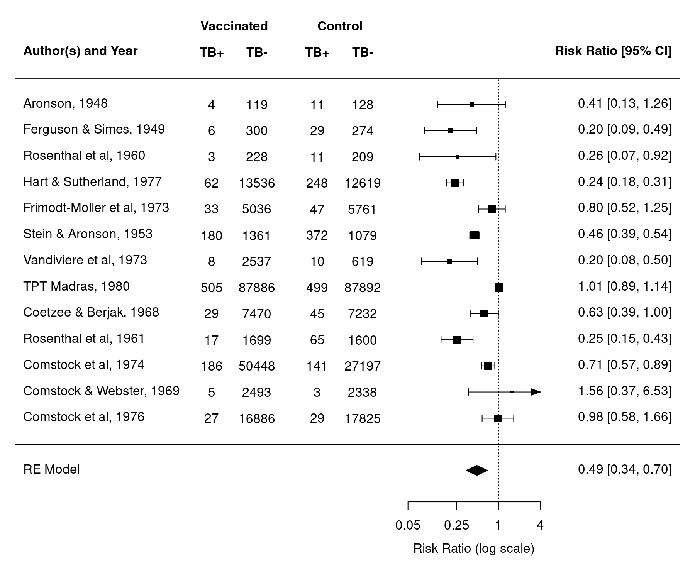
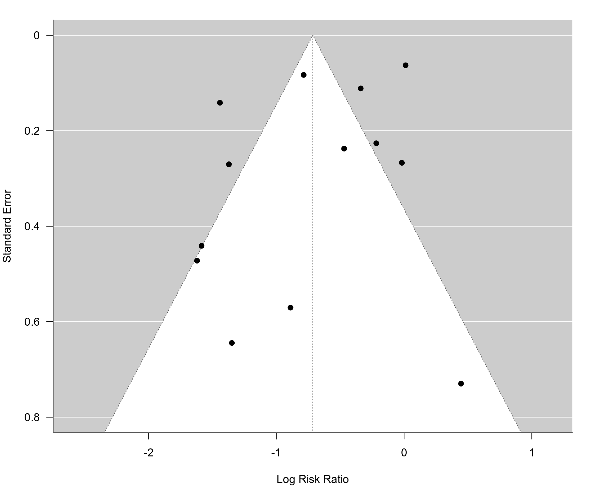
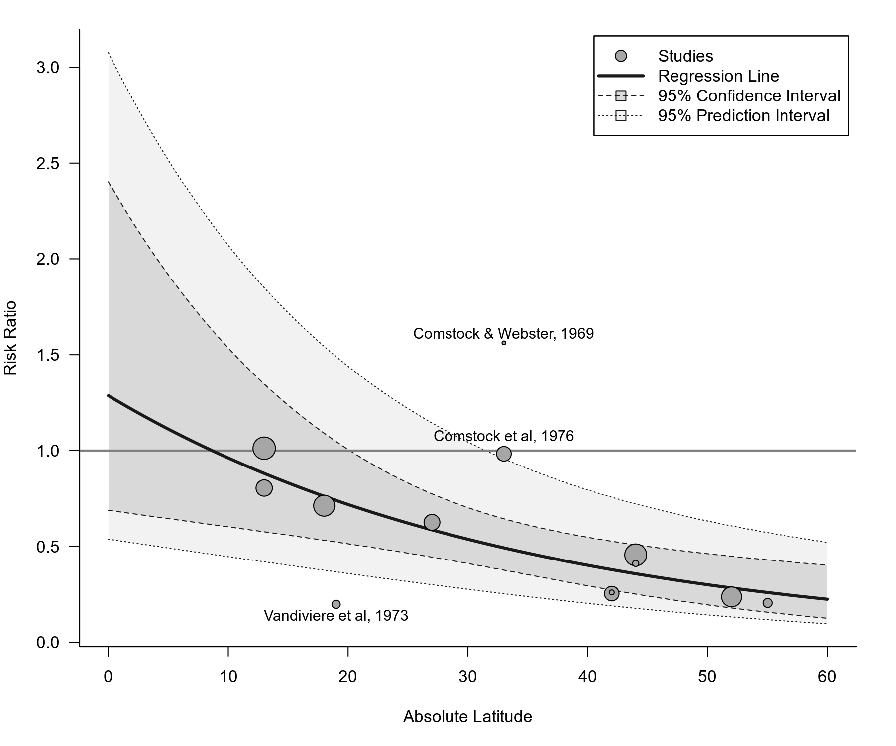

metafor: A Meta-Analysis Package for R
======================================

[](https://www.gnu.org/licenses/old-licenses/gpl-2.0.en.html)
[](https://github.com/wviechtb/metafor/actions)
[](https://app.codecov.io/gh/wviechtb/metafor)
[](https://cran.r-project.org/package=metafor)
[](https://www.metafor-project.org/doku.php/installation#development_version)
[](https://cranlogs.r-pkg.org/badges/metafor)
[](https://cranlogs.r-pkg.org/badges/grand-total/metafor)

## Description

The `metafor` package is a comprehensive collection of functions for conducting meta-analyses in R. The package includes functions to calculate various effect sizes or outcome measures, fit equal-, fixed-, random-, and mixed-effects models to such data, carry out moderator and meta-regression analyses, and create various types of meta-analytical plots (e.g., forest, funnel, radial, L'Abbé, Baujat, bubble, and GOSH plots). For meta-analyses of binomial and person-time data, the package also provides functions that implement specialized methods, including the Mantel-Haenszel method, Peto's method, and a variety of suitable generalized linear (mixed-effects) models (i.e., mixed-effects logistic and Poisson regression models). Finally, the package provides functionality for fitting meta-analytic multivariate/multilevel models that account for non-independent sampling errors and/or true effects (e.g., due to the inclusion of multiple treatment studies, multiple endpoints, or other forms of clustering). Network meta-analyses and meta-analyses accounting for known correlation structures (e.g., due to phylogenetic relatedness) can also be conducted.

## Package Website

The `metafor` package website can be found at [https://www.metafor-project.org](https://www.metafor-project.org). On the website, you can find:

* some [news](https://www.metafor-project.org/doku.php/news:news) concerning the package and/or its development,
* a more detailed description of the [package features](https://www.metafor-project.org/doku.php/features),
* a log of the [package updates](https://www.metafor-project.org/doku.php/updates) that have been made over the years,
* a [to-do list](https://www.metafor-project.org/doku.php/todo) and a description of planned features to be implemented in the future,
* information on how to [download and install](https://www.metafor-project.org/doku.php/installation) the package,
* information on how to obtain [documentation and help](https://www.metafor-project.org/doku.php/help) with using the package,
* some [analysis examples](https://www.metafor-project.org/doku.php/analyses) that illustrate various models, methods, and techniques,
* a little showcase of [plots and figures](https://www.metafor-project.org/doku.php/plots) that can be created with the package,
* some [tips and notes](https://www.metafor-project.org/doku.php/tips) that may be useful when working with the package,
* a list of people that have in some shape or form [contributed](https://www.metafor-project.org/doku.php/contributors) to the development of the package,
* a [frequently asked questions](https://www.metafor-project.org/doku.php/faq) section, and
* some [links](https://www.metafor-project.org/doku.php/links) to other websites related to software for meta-analysis.

## Documentation

A good starting place for those interested in using the `metafor` package is the following paper:

Viechtbauer, W. (2010). Conducting meta-analyses in R with the metafor package. *Journal of Statistical Software, 36*(3), 1-48. [https://doi.org/10.18637/jss.v036.i03](https://doi.org/10.18637/jss.v036.i03)

In addition to reading the paper, carefully read the [package intro](https://wviechtb.github.io/metafor/reference/metafor-package.html) and then the help pages for the [`escalc`](https://wviechtb.github.io/metafor/reference/escalc.html) and the [`rma.uni`](https://wviechtb.github.io/metafor/reference/rma.uni.html) functions (or the [`rma.mh`](https://wviechtb.github.io/metafor/reference/rma.mh.html), [`rma.peto`](https://wviechtb.github.io/metafor/reference/rma.peto.html), [`rma.glmm`](https://wviechtb.github.io/metafor/reference/rma.glmm.html), [`rma.mv`](https://wviechtb.github.io/metafor/reference/rma.mv.html) functions if you intend to use these methods). The help pages for these functions provide links to many additional functions, which can be used after fitting a model. You can also read the entire documentation online at [https://wviechtb.github.io/metafor/](https://wviechtb.github.io/metafor/) (where it is nicely formatted, equations are shown correctly, and the output from all examples is provided).

## Installation

The current official (i.e., [CRAN](https://cran.r-project.org/package=metafor)) release can be installed within R with:
```r
install.packages("metafor")
```

The development version of the package can be installed with:
```r
install.packages("remotes")
remotes::install_github("wviechtb/metafor")
```
This builds the package from source based on the current version on [GitHub](https://github.com/wviechtb/metafor).

## Example

```r
# load metafor package
library(metafor)

# examine the BCG vaccine dataset
dat.bcg
```

```
##    trial               author year tpos  tneg cpos  cneg ablat      alloc
## 1      1              Aronson 1948    4   119   11   128    44     random
## 2      2     Ferguson & Simes 1949    6   300   29   274    55     random
## 3      3      Rosenthal et al 1960    3   228   11   209    42     random
## 4      4    Hart & Sutherland 1977   62 13536  248 12619    52     random
## 5      5 Frimodt-Moller et al 1973   33  5036   47  5761    13  alternate
## 6      6      Stein & Aronson 1953  180  1361  372  1079    44  alternate
## 7      7     Vandiviere et al 1973    8  2537   10   619    19     random
## 8      8           TPT Madras 1980  505 87886  499 87892    13     random
## 9      9     Coetzee & Berjak 1968   29  7470   45  7232    27     random
## 10    10      Rosenthal et al 1961   17  1699   65  1600    42 systematic
## 11    11       Comstock et al 1974  186 50448  141 27197    18 systematic
## 12    12   Comstock & Webster 1969    5  2493    3  2338    33 systematic
## 13    13       Comstock et al 1976   27 16886   29 17825    33 systematic
```

```r
# tpos  - number of TB positive cases in the treated (vaccinated) group
# tneg  - number of TB negative cases in the treated (vaccinated) group
# cpos  - number of TB positive cases in the control (non-vaccinated) group
# cneg  - number of TB negative cases in the control (non-vaccinated) group
#
# these variables denote the values in 2x2 tables of the form:
#
#           TB+    TB-
#         +------+------+
# treated | tpos | tneg |
#         +------+------+
# control | cpos | cneg |
#         +------+------+
#
# year  - publication year of the study
# ablat - absolute latitude of the study location (in degrees)
# alloc - method of treatment allocation (random, alternate, or systematic assignment)

# calculate log risk ratios and corresponding sampling variances for the BCG vaccine dataset
dat <- escalc(measure="RR", ai=tpos, bi=tneg, ci=cpos, di=cneg, data=dat.bcg,
              slab=paste(author, year, sep=", ")) # also add study labels
dat
```

```
##    trial               author year tpos  tneg cpos  cneg ablat      alloc      yi     vi
## 1      1              Aronson 1948    4   119   11   128    44     random -0.8893 0.3256
## 2      2     Ferguson & Simes 1949    6   300   29   274    55     random -1.5854 0.1946
## 3      3      Rosenthal et al 1960    3   228   11   209    42     random -1.3481 0.4154
## 4      4    Hart & Sutherland 1977   62 13536  248 12619    52     random -1.4416 0.0200
## 5      5 Frimodt-Moller et al 1973   33  5036   47  5761    13  alternate -0.2175 0.0512
## 6      6      Stein & Aronson 1953  180  1361  372  1079    44  alternate -0.7861 0.0069
## 7      7     Vandiviere et al 1973    8  2537   10   619    19     random -1.6209 0.2230
## 8      8           TPT Madras 1980  505 87886  499 87892    13     random  0.0120 0.0040
## 9      9     Coetzee & Berjak 1968   29  7470   45  7232    27     random -0.4694 0.0564
## 10    10      Rosenthal et al 1961   17  1699   65  1600    42 systematic -1.3713 0.0730
## 11    11       Comstock et al 1974  186 50448  141 27197    18 systematic -0.3394 0.0124
## 12    12   Comstock & Webster 1969    5  2493    3  2338    33 systematic  0.4459 0.5325
## 13    13       Comstock et al 1976   27 16886   29 17825    33 systematic -0.0173 0.0714
```

```r
# fit random-effects model
res <- rma(yi, vi, data=dat, test="knha")
res
```

```
## Random-Effects Model (k = 13; tau^2 estimator: REML)
##
## tau^2 (estimated amount of total heterogeneity): 0.3132 (SE = 0.1664)
## tau (square root of estimated tau^2 value):      0.5597
## I^2 (total heterogeneity / total variability):   92.22%
## H^2 (total variability / sampling variability):  12.86
##
## Test for Heterogeneity:
## Q(df = 12) = 152.2330, p-val < .0001
##
## Model Results:
##
## estimate      se     tval  df    pval    ci.lb    ci.ub
##  -0.7145  0.1808  -3.9522  12  0.0019  -1.1084  -0.3206  **
##
## ---
## Signif. codes:  0 '***' 0.001 '**' 0.01 '*' 0.05 '.' 0.1 ' ' 1
```

```r
# predicted pooled risk ratio (with 95% confidence/prediction intervals)
predict(res, transf=exp, digits=2)
```

```
## pred ci.lb ci.ub pi.lb pi.ub
## 0.49  0.33  0.73  0.14  1.76
```

```r
# forest plot
forest(res, atransf=exp, at=log(c(.05, .25, 1, 4)), xlim=c(-16,6),
       ilab=cbind(tpos, tneg, cpos, cneg), ilab.xpos=c(-9.5,-8,-6,-4.5),
       header="Author(s) and Year")
text(c(-9.5,-8,-6,-4.5), 15, c("TB+", "TB-", "TB+", "TB-"), font=2)
text(c(-8.75,-5.25),     16, c("Vaccinated", "Control"), font=2)
```



```r
# funnel plot
funnel(res, ylim=c(0,0.8), las=1)
```



```r
# regression test for funnel plot asymmetry
regtest(res)
```

```
## Regression Test for Funnel Plot Asymmetry
##
## Model:     mixed-effects meta-regression model
## Predictor: standard error
##
## Test for Funnel Plot Asymmetry: t = -0.7812, df = 11, p = 0.4512
## Limit Estimate (as sei -> 0):   b = -0.5104 (CI: -1.2123, 0.1915)
```

```r
# mixed-effects meta-regression model with absolute latitude as moderator
res <- rma(yi, vi, mods = ~ ablat, data=dat, test="knha")
res
```

```
## Mixed-Effects Model (k = 13; tau^2 estimator: REML)
##
## tau^2 (estimated amount of residual heterogeneity):     0.0764 (SE = 0.0591)
## tau (square root of estimated tau^2 value):             0.2763
## I^2 (residual heterogeneity / unaccounted variability): 68.39%
## H^2 (unaccounted variability / sampling variability):   3.16
## R^2 (amount of heterogeneity accounted for):            75.62%
##
## Test for Residual Heterogeneity:
## QE(df = 11) = 30.7331, p-val = 0.0012
##
## Test of Moderators (coefficient 2):
## F(df1 = 1, df2 = 11) = 12.5905, p-val = 0.0046
##
## Model Results:
##
##          estimate      se     tval  df    pval    ci.lb    ci.ub
## intrcpt    0.2515  0.2839   0.8857  11  0.3948  -0.3735   0.8764
## ablat     -0.0291  0.0082  -3.5483  11  0.0046  -0.0472  -0.0111  **
##
## ---
## Signif. codes:  0 '***' 0.001 '**' 0.01 '*' 0.05 '.' 0.1 ' ' 1
```

```r
# bubble plot (with points outside of the prediction interval labeled)
regplot(res, mod="ablat", pi=TRUE, xlab="Absolute Latitude",
        xlim=c(0,60), predlim=c(0,60), transf=exp, refline=1, legend=TRUE,
        label="piout", labsize=0.9, bty="l", las=1, digits=1)
```



## Meta

The metafor package was written by [Wolfgang Viechtbauer](https://www.wvbauer.com/). It is licensed under the [GNU General Public License](https://www.gnu.org/licenses/old-licenses/gpl-2.0.txt). For citation info, type `citation(package='metafor')` in R. To report any issues or bugs or to suggest enhancements to the package, please go [here](https://github.com/wviechtb/metafor/issues).
