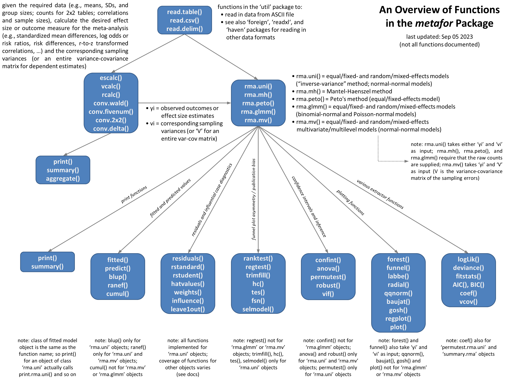

The diagram below shows the various functions in the metafor package (and how they are related to each other). If the package is installed, you should also be able to open this diagram directly from R with the command `vignette("diagram")`. The image below should also be clickable (to see a larger version of it).

------

